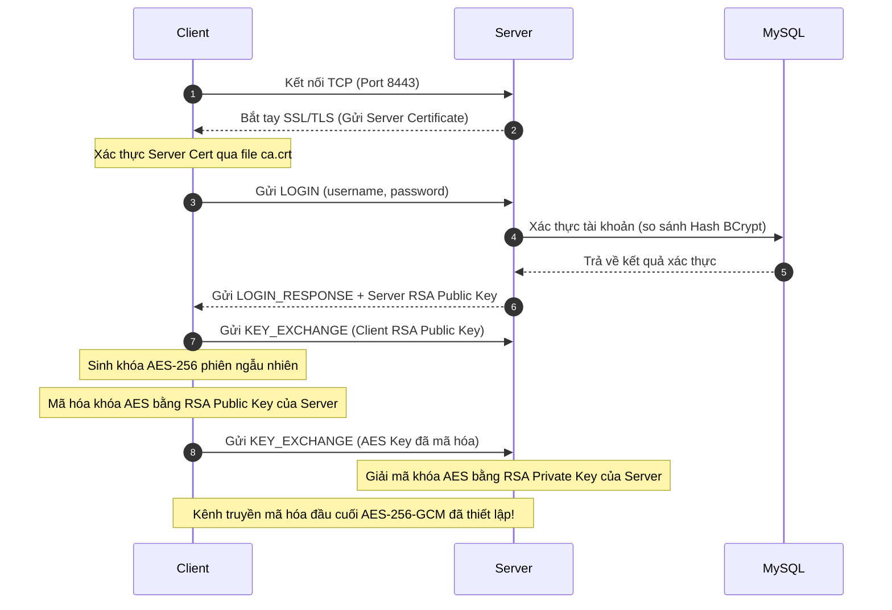

# TÀI LIỆU PHÂN TÍCH THIẾT KẾ HỆ THỐNG SECURE CHAT
## Môn học: Lập trình mạng - VHU

Tài liệu này trình bày chi tiết về kiến trúc socket, luồng vận hành giao thức, cách áp dụng DTO, cơ cấu kết nối cơ sở dữ liệu và các giải pháp mã hóa bảo mật được cài đặt trong hệ thống **Secure Chat System (Fatebook)**.

---

## 1. Cách Sử dụng Socket & Luồng Vận Hành Hệ Thống

Hệ thống sử dụng cơ chế socket TCP truyền dẫn dòng tin cậy (stream-oriented), được bảo mật hóa thông qua lớp Transport Security sử dụng chứng chỉ số tự ký (Self-signed Certificate).

### 1.1. Cách Sử dụng Socket
* **Phía Server**:
  * Sử dụng lớp `TcpListener` lắng nghe trên hai cổng mạng chính:
    * **Cổng 8443 (`CHAT_PORT`)**: Kênh truyền giao tiếp điều khiển chính (nhắn tin, đăng nhập, đồng bộ trạng thái, gọi video).
    * **Cổng 8444 (`FILE_PORT`)**: Kênh truyền tệp tin chuyên biệt (truyền mảng byte dữ liệu file lớn dưới dạng nhị phân độc lập để tránh nghẽn kênh chat).
  * Mỗi khi có client kết nối (`AcceptTcpClient`), Server bọc socket bằng lớp `SslStream` nhằm thực hiện mã hóa đường truyền SSL/TLS trước khi trao đổi dữ liệu.
* **Phía Client**:
  * Sử dụng `TcpClient` kết nối trực tiếp đến IP Server thông qua cổng `8443`.
  * Client sử dụng tập tin chứng chỉ cục bộ `certs/ca.crt` để xác thực danh tính chứng chỉ `server.pfx` từ máy chủ (chống tấn công giả mạo Man-In-The-Middle - MITM).

### 1.2. Thiết kế đa luồng thủ công
Hệ thống không sử dụng `ThreadPool`, `Task.Run` hoặc `async/await` cho luồng mạng. Các luồng được tạo trực tiếp bằng `System.Threading.Thread`:

* **Server**:
  * Main thread chờ kết nối chat tại cổng `8443`.
  * Mỗi client chat được cấp một thread nền riêng trong `ClientHandler`.
  * Một thread listener riêng chờ kết nối truyền file tại cổng `8444`.
  * Mỗi kết nối truyền file được cấp một thread nền riêng.
* **Client**:
  * UI thread của WinForms chỉ xử lý giao diện.
  * Một thread riêng thực hiện đăng nhập và bắt tay TLS/RSA/AES.
  * Một thread riêng đọc liên tục dữ liệu từ server.
  * Mỗi thao tác gửi tin nhắn hoặc gửi file được thực hiện trên thread tạo thủ công.
  * Dữ liệu nhận từ thread mạng được chuyển về UI thread bằng `BeginInvoke`.

Các thread mạng đều đặt `IsBackground = true` để không giữ tiến trình sống khi cửa sổ chính đã đóng.

### 1.3. Luồng Vận Hành Kết Nối & Handshake (Bắt tay bảo mật)
Khi Client bắt đầu kết nối tới Server, tiến trình diễn ra theo sơ đồ sau:

1. **Kết nối SSL/TLS**: Thiết lập dòng dữ liệu mã hóa đồng bộ qua `SslStream.AuthenticateAsClient` (Client) và `AuthenticateAsServer` (Server) trên các thread mạng riêng.
2. **Xác thực người dùng**: Client gửi gói tin `LOGIN`. Server kiểm tra mật khẩu bằng thuật toán BCrypt chống brute-force đối chiếu với cơ sở dữ liệu MySQL.
3. **Trao đổi Khóa RSA**: Server sinh cặp khóa RSA tạm thời cho phiên và gửi khóa công khai cho Client trong phản hồi `LOGIN_RESPONSE`.
4. **Đăng ký Khóa Client**: Client sinh cặp khóa RSA của mình, gửi khóa công khai lên Server để cập nhật vào cơ sở dữ liệu.
5. **Thống nhất Khóa Phiên AES**: Client tạo khóa đối xứng AES-256 ngẫu nhiên dùng riêng cho phiên này, mã hóa nó bằng khóa công khai RSA của Server, rồi gửi gói tin mã hóa lên Server. Server giải mã thu được khóa phiên. Kể từ thời điểm này, mọi dữ liệu nội dung tin nhắn và file sẽ được mã hóa bằng khóa phiên này.

### 1.4. Luồng Gửi Nhận Tin Nhắn & Truyền File
* **Nhắn tin văn bản (Text)**:
  1. Client mã hóa văn bản gốc bằng khóa AES của mình -> chuyển sang Base64 -> đóng gói vào `MessageDTO` dạng `TEXT`.
  2. Server nhận gói tin, giải mã bằng khóa AES của người gửi, rồi mã hóa lại bằng khóa AES của từng người nhận trong phòng trước khi chuyển tiếp (dịch khóa đối xứng để bảo mật tối đa).
* **Truyền tệp tin (File)**:
  1. Client mã hóa toàn bộ byte dữ liệu của file bằng khóa phiên AES.
  2. Client mở kết nối phụ độc lập qua cổng TCP `8444` (qua kênh TLS), gửi thông tin metadata (RoomId, SenderId, FileName, FileSize) cùng mảng byte dữ liệu đã mã hóa.
  3. Server tiếp nhận, giải mã kiểm tra tính toàn vẹn, sau đó mã hóa lại bằng khóa đối xứng của người nhận và gửi cho client đích.

### 1.5. Luồng Gọi Video (Video Call Flow)
* **Kết nối cuộc gọi**:
  1. Người gọi bấm gọi -> Client gửi tin nhắn điều khiển `VIDEO_INVITE` qua cổng `8443`.
  2. Người nhận hiển thị popup xác nhận. Nếu đồng ý, gửi lại `VIDEO_ACCEPT`. Nếu từ chối, gửi `VIDEO_REJECT`.
* **Truyền luồng hình ảnh**:
  1. Camera (hoặc camera giả lập sử dụng Timer vẽ vòng tròn chuyển động tuần hoàn) chụp ảnh liên tục (~5 FPS).
  2. Khung hình được nén thành dạng định dạng JPEG để giảm băng thông -> chuyển sang dạng chuỗi Base64.
  3. Chuỗi Base64 của ảnh được mã hóa AES-256-GCM bằng khóa đối xứng của phiên -> Đóng gói vào `MessageDTO` dạng `VIDEO_FRAME` gửi lên Server.
  4. Server tiếp nhận gói tin `VIDEO_FRAME`, chuyển tiếp (sau khi giải mã và mã hóa lại với khóa của đầu nhận) đến Client nhận cuộc gọi.
  5. Client nhận cuộc gọi giải mã chuỗi Base64, dựng lại thành một bitmap độc lập và hiển thị lên PictureBox `picRemote`.

---

## 2. Kiến Thức DTO (Data Transfer Object) Được Áp Dụng Như Thế Nào

**Data Transfer Object (DTO)** là một mẫu thiết kế (design pattern) dùng để truyền tải dữ liệu giữa các tiến trình hoặc hệ thống khác nhau (ở đây là giữa Client và Server qua socket). 

### 2.1. Thiết kế của lớp DTO chính (`MessageDTO.cs`)
Hệ thống hợp nhất toàn bộ giao thức truyền thông thành một DTO chung duy nhất là `MessageDTO`, có định dạng thuộc tính rõ ràng:
* **`Type` (MessageType enum)**: Xác định mục đích gói dữ liệu (ví dụ: `TEXT`, `FILE`, `LOGIN`, `KEY_EXCHANGE`, `VIDEO_FRAME`,...).
* **`SenderId` / `SenderUsername`**: Nhận diện thông tin người gửi.
* **`TargetUserId` / `RoomId`**: Xác định đích đến của tin nhắn.
* **`EncryptedContent`**: Trường chứa dữ liệu đã mã hóa AES (Base64) đối với tin nhắn và dữ liệu camera.
* **`PlainContent`**: Trường chứa dữ liệu dạng văn bản rõ không nhạy cảm (dành cho thông tin đăng nhập `username:password` hoặc thông điệp hệ thống).
* **`FileName` / `FileSize`**: Metadata phục vụ riêng cho tác vụ gửi file.
* **`Timestamp`**: Thời điểm gửi tin nhắn định dạng Epoch Milliseconds.

### 2.2. Vai trò và Lợi ích của DTO trong hệ thống
* **Chuẩn hóa dữ liệu truyền dẫn**: Toàn bộ dữ liệu gửi qua socket đều được tuần tự hóa (Serialize) thành định dạng văn bản JSON thống nhất (`JsonSerializer.Serialize(msg)`). Khi nhận được, chỉ cần giải tuần tự hóa (Deserialize) để phục hồi thành một thực thể C# nguyên bản.
* **Tách biệt kiến trúc**: DTO che giấu các thực thể hoặc cấu trúc bảng phức tạp trong cơ sở dữ liệu. Client không cần biết cấu trúc bảng MySQL của Server, và Server cũng không cần quan tâm đến cấu trúc cơ sở dữ liệu SQLite của Client. Cả hai chỉ giao tiếp qua giao diện trung gian là DTO.
* **Tối ưu hiệu năng truyền tải**: Gộp tất cả các dữ liệu cần thiết (metadata + nội dung) vào một đối tượng duy nhất, tránh việc phải gửi nhiều gói tin nhỏ lẻ qua socket.

---

## 3. Cách Kết Nối Cơ Sở Dữ Liệu (Database Connection)

Hệ thống sử dụng cơ chế lưu trữ phân tán 2 lớp (Server DB + Client Local DB):

### 3.1. Kết nối CSDL Phía Server (MySQL qua MySqlConnector)
* **Công nghệ**: Sử dụng thư viện kết nối phi thương mại hiệu năng cao `MySqlConnector` để giao tiếp với MySQL (XAMPP).
* **Cấu hình kết nối**: Lớp `DatabaseConnection.cs` quản lý Connection String mặc định:
  `Server=localhost;Port=3306;Database=secure_chat;Uid=root;Pwd=;`
* **Cách thức vận hành**:
  * Mỗi khi cần thực hiện truy vấn (thêm tin nhắn, xác thực người dùng), Server sẽ gọi `DatabaseConnection.GetConnection()` để mở một kết nối mới, thực thi câu lệnh SQL qua lớp `MySqlCommand` và tự động giải phóng kết nối (`using` block) để tránh rò rỉ tài nguyên (connection leak).
  * **Cấu trúc dữ liệu chính**:
    * Bảng `users`: Lưu trữ thông tin đăng ký, mật khẩu băm, và khóa công khai RSA của mỗi tài khoản.
    * Bảng `chat_rooms`: Quản lý các phòng chat (bao gồm phòng ảo giữa 2 người và phòng nhóm).
    * Bảng `messages`: Lưu trữ lịch sử tin nhắn. **Lưu ý quan trọng**: Nội dung tin nhắn trong cột `encrypted_content` được lưu trữ dưới dạng đã mã hóa AES-GCM (Base64) để đảm bảo ngay cả quản trị viên quản lý cơ sở dữ liệu MySQL cũng không thể đọc trộm tin nhắn của người dùng.

### 3.2. Kết nối CSDL Phía Client (SQLite)
* **Công nghệ**: Sử dụng SQLite (`LocalHistoryDB.cs` ở phía Client) làm cơ sở dữ liệu nhúng (embedded database) cục bộ.
* **Cách thức vận hành**:
  * Lưu trữ file database riêng biệt cho từng người dùng tại đường dẫn: `%USERPROFILE%\.securechat\{username}_history.db`.
  * SQLite lưu trữ tin nhắn dưới dạng văn bản rõ (plaintext) cục bộ trên máy cá nhân để người dùng có thể tra cứu lịch sử nhanh chóng khi offline mà không cần kết nối Internet hoặc Server.

---

## 4. Công Cụ & Thuật Toán Mã Hóa Tin Nhắn (Cryptography Tools)

Hệ thống áp dụng kiến trúc bảo mật đa lớp nâng cao để bảo vệ dữ liệu ở cả hai trạng thái: đang truyền trên mạng (in transit) và lưu trữ tĩnh (at rest).

### 4.1. Mã Hóa Kênh Truyền (Transport Layer Security - SSL/TLS)
* **Lớp áp dụng**: `SslStream` bọc ngoài lớp TCP socket.
* **Mục đích**: Mã hóa toàn bộ dữ liệu trao đổi qua socket (kể cả metadata gói tin, tên đăng nhập, mật khẩu). Ngăn chặn kẻ tấn công trên mạng nội bộ hoặc nhà cung cấp dịch vụ mạng (ISP) nghe lén dữ liệu thô (sniffing) hoặc thay đổi gói tin trên đường truyền.

### 4.2. Mã Hóa Bất Đối Xứng Trao Đổi Khóa (RSA-2048 / OAEP-SHA256)
* **Công cụ**: Lớp `System.Security.Cryptography.RSA` trong thư viện chuẩn của .NET Core / .NET 8.0.
* **Mục đích**: Giải quyết bài toán phân phối khóa an toàn. Mỗi phiên kết nối, Server và Client sẽ sử dụng RSA-2048 để trao đổi khóa đối xứng AES.
* **Đệm mã hóa**: `RSAEncryptionPadding.OaepSHA256` (được khuyến nghị bởi các tiêu chuẩn bảo mật hiện đại nhằm tránh các lỗ hổng tấn công padding oracle).

### 4.3. Mã Hóa Đối Xứng Đầu Cuối (AES-256-GCM)
* **Công cụ**: Lớp `System.Security.Cryptography.AesGcm` tích hợp sẵn trong .NET.
* **Mục đích**: Mã hóa trực tiếp nội dung tin nhắn (`TEXT`), tệp tin đính kèm (`FILE`) và hình ảnh cuộc gọi (`VIDEO_FRAME`) từ thiết bị người gửi đến thiết bị người nhận (End-to-End Encryption - E2EE).
* **Đặc tính kỹ thuật**:
  * Sử dụng khóa phiên 256 bits mạnh mẽ sinh ngẫu nhiên cho mỗi phiên kết nối.
  * Chế độ **GCM (Galois/Counter Mode)** cung cấp tính năng **AEAD** (Authenticated Encryption with Associated Data). Điều này có nghĩa là thuật toán vừa mã hóa dữ liệu bảo mật, vừa sinh ra một thẻ xác thực đi kèm (`AuthTag` - 16 bytes) để đảm bảo dữ liệu không bị sửa đổi, giả mạo trong suốt hành trình gửi đi.
  * Mỗi gói tin mã hóa chứa: `IV` (12 bytes) + `Ciphertext` + `AuthTag` (16 bytes) được gộp lại và chuyển sang Base64 trước khi truyền qua socket.

### 4.4. Băm Mật Khẩu (BCrypt)
* **Công cụ**: Thư viện `BCrypt.Net-Next` ở phía Server.
* **Mục đích**: Băm mật khẩu người dùng trước khi lưu trữ vào cơ sở dữ liệu MySQL. BCrypt tự động chèn thêm muối (salt) ngẫu nhiên và có cơ chế làm chậm thời gian tính toán (work factor = 12) giúp chống lại các cuộc tấn công bảng tra cứu trước (Rainbow Table) và đoán mò mật khẩu quy mô lớn.
